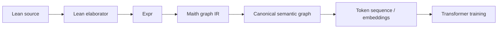

# Maith: Semantic IR for Lean Mathematics

Maith is a Lean 4 project for extracting a canonical semantic representation of formal mathematics from elaborated Lean terms (`Expr`), then serializing that representation into token sequences for downstream language-model training.

## 1) Research Question

Can language models become better theorem provers if trained on a representation of mathematics that exposes semantic structure rather than source syntax?

## 2) Hypothesis

Our central hypothesis is that language models trained on a canonical semantic representation of formal mathematics — rather than raw proof assistant source code — will learn more useful mathematical representations, resulting in improved theorem prediction, proof search, and proof completion.

Maith is a **candidate representation** for testing that hypothesis; effectiveness is not assumed and remains to be demonstrated empirically.

## 3) Why This Matters

Recent progress in automated theorem proving with language models has focused heavily on model scale and data quantity. We hypothesize that representation choice is also a major bottleneck: if training data exposes semantic structure more directly, models may need less capacity to learn equivalent mathematical patterns. Maith exists to make that hypothesis testable in a Lean/Mathlib setting.

## 4) Approach

Maith does **not** parse Lean source strings into IR. Instead, it runs inside Lean and extracts IR from the elaborated environment (`Environment`, `ConstantInfo`, `Expr`), where implicit arguments, notation expansion, and typing information are already resolved.

High-level flow:

- Extract declaration semantics from elaborated `Expr` trees (`MetaExtractor.lean`)
- Build IR Graph (`Entity`, `Attribute`, `Relation`, `Operation`)
- Canonicalize graph ordering (`Normalizer.lean`)
- Encode canonical graph to tokens (`Encoder.lean`) — **currently a scaffold, see Limitations**
- Serialize examples to JSONL (`CorpusSerializer.lean`)
- Consume JSONL in `python/` for vocab/tokenizer, splits, and dataset objects

The extraction stage (`MetaExtractor.lean` → IR Graph → `Normalizer.lean`) is the part that has been run against real Mathlib code and produced the results in section 7. The encode/decode/transpile stage is not yet at that level of maturity — see Limitations below before assuming the full pipeline is end-to-end functional.

## 5) Why Not Train Directly on Lean Source?

This section is motivation, not a claim of proven superiority.

We hypothesize that source-token training may be less sample-efficient because:

- Lean notation can hide semantic equivalences that elaborate to similar terms.
- Elaboration inserts implicit arguments that are absent in surface syntax.
- Macros and coercions can map many textual forms to related elaborated structures.
- Multiple syntactic encodings of the same idea may collapse into a smaller set of semantic patterns after elaboration.

We expect a canonical semantic representation to be easier for sequence models to learn from than raw source in at least some theorem-prediction/proof-search settings, but this remains to be tested.

## 6) Architecture



Concrete pipeline in this repo:

`Lean environment -> MetaExtractor.lean -> IR Graph -> Normalizer.lean -> canonical graph -> Encoder.lean -> token sequence -> CorpusSerializer.lean -> corpus.jsonl -> python/`

The extraction and normalization stages (up through the canonical graph) are implemented and validated against real Mathlib input (see section 7). The encoder/decoder stage past that point is currently a placeholder implementation — see Limitations.

## 7) Current Status / Results

### Build and tests

- `lake build tests` passes (**66 jobs, 0 failures**).
- All tests pass (**54 unit tests + corpus-pipeline/serializer integration checks**).

### Corpus extraction result (real run)

Target module: `Mathlib.Algebra.Group.Defs`  
Total declarations: **1,129**

| | Count | % |
|---|---|---|
| **Successful extractions** | **792** | **70%** |
| Failed | 337 | 30% |

Failure breakdown (exhaustive):

| Count | Reason |
|---|---|
| 217 | type extraction failed: HOF application (non-constant head) |
| 62 | value extraction failed: projection expression |
| 48 | value extraction failed: HOF application (non-constant head) |
| 6 | value extraction failed: let expression |
| 4 | value extraction failed: `Eq` arity (heterogeneous equality) |

Non-trivial extracted examples:

| Declaration | Entities | Relations | Operations |
|---|---|---|---|
| `mul_assoc` | 11 | 5 | 5 |
| `mul_comm` | 8 | 4 | 3 |
| `mul_one` | 11 | 3 | 6 |
| `DivisionMonoid.mk` | 34 | 14 | 21 |

Important caveat: this has been validated against exactly one module (`Mathlib.Algebra.Group.Defs`). Broader module coverage will likely surface additional failure categories.

Evidence artifact committed intentionally: [`Corpus/corpus.jsonl`](Corpus/corpus.jsonl) (current 7.2MB extraction output for the module above).

### Binder scoping design (`EntityId.bound`)

Lean uses De Bruijn indices for bound variables, so index-only IDs can collide across declarations. Maith addresses this with scoped IDs:

- `EntityId.bound : String -> EntityId`
- current naming scheme: `"declName/depth/binderName"`

This avoids cross-declaration collisions and is covered by `testScopedBinderInjectivity` in `Tests/CorpusPipelineTests.lean`.

## 8) Limitations

- Validation so far is on one Mathlib module.
- **`Encoder.lean`, `Decoder.lean`, and `Transpiler.lean` are currently minimal scaffolds, not full implementations.** Each function compiles and passes its own unit tests against simple hand-constructed inputs, but the modules' own doc comments describe them as placeholder logic put in place to keep the project structurally complete while the real encode/decode/transpile logic is built out. `Decoder.lean` explicitly notes it is "NOT a full reversible codec." Treat the extraction and normalization stages (sections 4, 6, 7) as the validated part of the pipeline, and the encode/decode/transpile stage as not yet production-quality.
- No language model has been trained yet on Maith corpora.
- No comparative study against Lean-source tokenization or AST serialization has been run yet.
- Current extraction still has unresolved failure categories (see sections 7 and 9).

## 9) Research Roadmap

1. **Phase 1: Build semantic IR** — done (this repo)
2. **Phase 2: Extract large portions of Mathlib** — started (one module completed)
3. **Phase 2.5: Complete Encoder/Decoder/Transpiler implementations** — not started (currently scaffolds, see Limitations)
4. **Phase 3: Build token vocabulary** — in progress via `python/`
5. **Phase 4: Train transformer models** — not started
6. **Phase 5: Compare against raw Lean tokenization** — not started
7. **Phase 6: Measure theorem-proving performance** — not started

Remaining IR milestones with current size estimates:

- **HOF application support** (`bvar`/`fvar` as function head): **265 failures** (217 type + 48 value)
- **Projection expressions (`.proj`)**: **62 failures**
- **`letE` support**: **6 failures**
- **Heterogeneous `Eq` arity handling**: **4 failures**

## 10) Evaluation Plan

The core hypothesis will be tested by training and comparing models on:

1. Lean source tokens
2. Lean AST serialization
3. Maith semantic IR tokens

Candidate metrics (planned):

- Next-token prediction quality
- Proof completion performance
- Automated theorem-proving success rate
- Proof-search efficiency (time/steps)
- Embedding quality for mathematical similarity/retrieval

These comparative experiments have **not yet been run**, and depend on completing the encoder/decoder work noted in Limitations first. The current evidence is extraction feasibility and coverage (section 7), not theorem-proving performance.

## 11) Building the Project

```bash
git clone <repo-url>
cd Maith
lake build tests
./.lake/build/bin/tests
```

To run the current corpus build entry point:

```bash
cd Maith
cat > /tmp/run-corpus.lean << 'EOF'
import Maith.MathlibCorpusBuilder
open Lean.DSL
#eval buildMathlibIRCorpusCustomModules ["Mathlib.Algebra.Group.Defs"]
EOF
lake env lean /tmp/run-corpus.lean
```

Outputs are written under `Corpus/`:

- `Corpus/corpus.jsonl`
- `Corpus/stats.json`
- `Corpus/logs.txt`

This repository currently tracks these corpus artifacts intentionally so readers can inspect real output directly.

## 12) Repository Structure

```text
Maith/
  MetaExtractor.lean       # elaborated Lean Expr -> IR graph
  EntityId.lean            # includes EntityId.bound for scoped binders
  Normalizer.lean          # canonical ordering/normalization
  Encoder.lean             # graph -> token sequence (scaffold, see Limitations)
  Decoder.lean             # token -> graph parser (scaffold, not a full reversible codec)
  Transpiler.lean          # Lean syntax <-> IR graph (scaffold, see Limitations)
  CorpusSerializer.lean    # JSONL/stat serialization
  ProcessingPipeline.lean  # extraction + normalize + encode flow
  MathlibCorpusBuilder.lean
  ...
Tests/
  CorpusPipelineTests.lean
  InjectivityTests.lean
  DecoderTests.lean
  EncoderTests.lean
  ...
python/
  corpus_loader.py         # schema validation, loading, vocab build, split, dataset class
  build_dataset.py         # CLI entry point that loads corpus and builds train/eval datasets
docs/
  LATEST_FIXES.md
  SESSION_PROGRESS.md
  CORPUS_PIPELINE_STATUS.md
  TESTING_SUMMARY.md
  Design.md
  TEST.md
README.md
CORPUS_SCHEMA.md           # JSONL schema contract (kept as-is)
```

## 13) License

This project is licensed under the MIT License. See [LICENSE](LICENSE).
