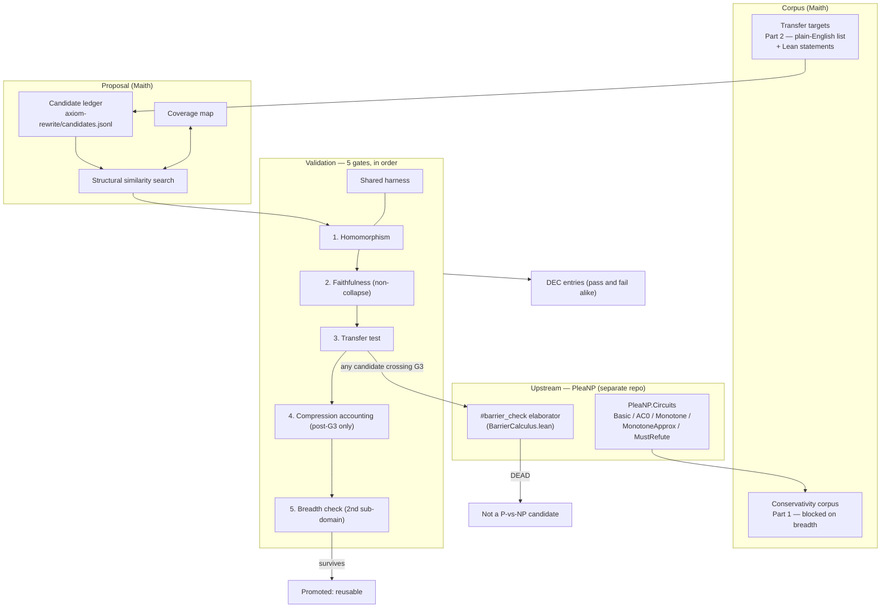

# Maith: Semantic IR for Lean Mathematics

> **Branch status.** **`dev` is the working branch** — all current work, including
> the active track described below, lands there first. `main` is the default branch
> GitHub shows visitors and is promoted from `dev`; if the two ever diverge, `dev`
> is authoritative. Commit to `dev`, never to `main` directly.

> **Active track: axiom discovery (2026-09-15 →).** The research direction has
> moved to **axiom discovery** — searching for a structure-preserving map φ
> that pulls existing theorems back into a new domain as kernel-checked
> transfer results. Toy-model training is shelved, not deleted. See
> [`AXIOM_DISCOVERY`](docs/experiments/AXIOM_DISCOVERY.md) and its companion
> corpus plan, [`BENCHMARK_CORPUS_PLAN`](docs/experiments/BENCHMARK_CORPUS_PLAN.md);
> prior-art grounding is [`PRIOR_ART` §9](docs/reference/PRIOR_ART.md)
> (DEC-054/055). The repo runs the PleaNP-derived CI and two-tier integrity
> gates ([`TOOLCHAIN_AND_CI`](docs/TOOLCHAIN_AND_CI.md)) and develops on a
> single `dev` branch.
>
> **⚠ Prediction-era results are under a reset notice.** The v2 prediction
> results headline the v1-era record (Variant A v2 perplexity 1.2361 / top-1
> 90.0% vs B-small 1.1294 / 90.5%; the 62-pp DEC-025 probe gap), but
> **DEC-031 (2026-08-12) invalidated the old comparison runs** —
> split leakage, epoch confounds, and dataset contamination. Clean retrains
> (A_v3_2ep, B_small_clean, flat_clean — all 3375/376, 2 epochs) are complete,
> and the hypothesis tests re-run on clean embeddings came back
> **ambiguous**: H6 retrieval disagrees between modes (DEC-034), and the H5
> contrastive objective reliably beats the next-token baseline but by a small
> margin far below the pretrained baseline (DEC-035). Read
> [`HYPOTHESIS_GRID`](docs/experiments/HYPOTHESIS_GRID.md) for per-claim
> status; treat any pre-invalidation number below as historical.
>
> Key docs: [`HYPOTHESIS_GRID`](docs/experiments/HYPOTHESIS_GRID.md) (sub-claim status) ·
> [`V2_COMPARISON_MATRIX`](docs/experiments/V2_COMPARISON_MATRIX.md) (control grid) ·
> [`H6_RESULTS`](docs/experiments/H6_RESULTS.md) (clean retrieval results) ·
> [`EXPERIMENT_DESIGN`](docs/experiments/EXPERIMENT_DESIGN.md) (evaluation framework) ·
> [`PRIOR_ART`](docs/reference/PRIOR_ART.md) (related work) ·
> [`LITERATURE_REVIEW_2026_08`](docs/experiments/LITERATURE_REVIEW_2026_08.md) (field check of open sub-claims) ·
> [`LEAN_PIPELINE_AUDIT_2026_08`](docs/experiments/LEAN_PIPELINE_AUDIT_2026_08.md) (Lean IR/corpus code audit) ·
> [`DECISION_LOG`](docs/decisions/LOG.md) (DEC-001..DEC-056).

## At a glance

- **Fully implemented pipeline**: extract → normalize → encode → train → decode → decompile, validated end-to-end (**2,554/2,554 declarations** round-trip cleanly on the 4-module corpus; the current v2 corpus is 4,029).
- **Structured experiments, honest results**: controlled grids with a size-matched BPE control and a 62-pp probe gap showing the IR encodes real semantics — but the prediction results are **under DEC-031's reset notice**, and the clean re-runs (DEC-034/035) are ambiguous rather than positive.
- **Open research practice**: hypothesis grid with per-claim status, experiment design, decision log (DEC-0xx), and prior-art review — so results are legible, not just reported.
- **Active track**: axiom discovery, guarded by ported integrity gates.

> Read the full background below, or jump to [hypotheses](docs/experiments/HYPOTHESIS_GRID.md) and [experiment design](docs/experiments/EXPERIMENT_DESIGN.md).

> **Built with agentic AI tooling.** The author directed agent-based coding workflows to architect, implement, and validate this pipeline — breaking work into task specs, reviewing output, and running the experiments. Commit history on this repo reflects that process.

Maith is a Lean 4 project for extracting a canonical semantic representation of formal mathematics from elaborated Lean terms (`Expr`), then serializing that representation into token sequences for downstream language-model training.

## 1) Research Question

Can language models become better theorem provers if trained on a representation of mathematics that exposes semantic structure rather than source syntax?

## 2) Hypothesis

Our central hypothesis is that language models trained on a canonical semantic representation of formal mathematics — rather than raw proof assistant source code — will learn more useful mathematical representations, resulting in improved theorem prediction, proof search, and proof completion.

Maith is a **candidate representation** for testing that hypothesis; effectiveness is not assumed and remains to be demonstrated empirically.

## 3) Why This Matters

Recent progress in automated theorem proving with language models has focused heavily on model scale and data quantity. We hypothesize that representation choice is also a major bottleneck: if training data exposes semantic structure more directly, models may need less capacity to learn equivalent mathematical patterns. Maith exists to make that hypothesis testable in a Lean/Mathlib setting.

## 4) Approach

Maith does **not** parse Lean source strings into IR. Instead, it runs inside Lean and extracts IR from the elaborated environment (`Environment`, `ConstantInfo`, `Expr`), where implicit arguments, notation expansion, and typing information are already resolved.

High-level flow:

- Extract declaration semantics from elaborated `Expr` trees (`MetaExtractor.lean`)
- Build IR Graph (`Entity`, `Attribute`, `Relation`, `Operation`)
- Canonicalize graph ordering (`Normalizer.lean`)
- Encode canonical graph to tokens (`Encoder.lean`) — v2.0.0, 601-token vocabulary
- Serialize examples to JSONL (`CorpusSerializer.lean`)
- Consume JSONL in `python/` for vocab/tokenizer, splits, and dataset objects
- Decode tokens back to graph (`Decoder.lean`)
- Decompile graph to Lean syntax (`Transpiler.lean` — `Decompile.decompileGraph`)

The full pipeline is implemented and validated end-to-end: 2,554/2,554 declarations round-trip cleanly through encode → decode → decompile (see `python/validate_roundtrip.py` and `docs/reference/DECOMPILER_HANDOVER.md`), confirming token/graph losslessness and Lean syntax reconstruction. The current v2 corpus covers 14 Mathlib modules (4,029 extracted examples, 0 failures; clean split 3,375 train / 376 eval after DEC-031).

## 5) Why Not Train Directly on Lean Source?

This section is motivation, not a claim of proven superiority.

We hypothesize that source-token training may be less sample-efficient because:

- Lean notation can hide semantic equivalences that elaborate to similar terms.
- Elaboration inserts implicit arguments that are absent in surface syntax.
- Macros and coercions can map many textual forms to related elaborated structures.
- Multiple syntactic encodings of the same idea may collapse into a smaller set of semantic patterns after elaboration.

We expect a canonical semantic representation to be easier for sequence models to learn from than raw source in at least some theorem-prediction/proof-search settings. **This is not yet supported by the experimental record:** the v2 control grid (DEC-026/027) finds the IR encodes semantics (DEC-025) but does not outperform a size-matched BPE baseline on next-token prediction or completion accuracy. See [`docs/reference/PRIOR_ART.md`](docs/reference/PRIOR_ART.md) for the related work that motivates this hypothesis and the closest positive-result counterpart (IRCoder).

## 6) Architecture


```mermaid
flowchart LR
    A[Lean source / Mathlib modules] --> B[Lean elaborator]
    B --> C[Expr + Environment]
    C --> D[MetaExtractor.lean]
    D --> E[IR Graph]
    E --> F[Normalizer.lean]
    F --> G[Canonical graph]
    G --> H[Encoder.lean v1.2.0]
    H --> I[Token sequence — v1-style strings]
    I --> J[CorpusSerializer.lean]
    J --> K[Corpus/corpus.jsonl — v1 tokens, NOT committed]
    K --> L[python/build_dataset.py]
    L --> L1[v2 re-encode: C1/C2/C4 + integer mapping via vocab_A.json]
    L1 --> M[datasets/train_*.jsonl + eval_*.jsonl — integer input_ids]
    M --> N[python/train.py variants A/B/C]
    N --> O[runs/variant_*/results.json + loss_curve.json]
```

> **Where v2 encoding and integer mapping actually happen (diagram correction).**
> The Lean-side `Encoder.lean` emits **v1-style string tokens** (`neut`, `gen:<FullName>`)
> into `corpus.jsonl`. The **v2 token stream** (C1 polarity removal, C2 typeclass short
> names, C4 GEN bucketing) and the **token→integer mapping** are both produced in
> `python/build_dataset.py`'s `encode_ir` + `build_ir_vocab` at dataset-build time — not
> in Lean, and not in `train.py`. So `corpus.jsonl` holds v1-style strings; the v2
> integers exist only in `datasets/train_*.jsonl` (`input_ids`/`labels`). See
> [`CORPUS_SCHEMA.md`](docs/reference/CORPUS_SCHEMA.md) and
> [`build_dataset.py`](python/build_dataset.py) `encode_ir`/`bucket_from_module`.
> `Corpus/corpus.jsonl` itself is gitignored (not committed); `Corpus/corpus_manifest.json`
> records its hash and regeneration command.

Concrete pipeline in this repo:

`Lean environment -> MetaExtractor.lean -> IR Graph -> Normalizer.lean -> canonical graph -> Encoder.lean (v1 strings) -> corpus.jsonl -> build_dataset.py (v2 encode + int map) -> datasets/train_*.jsonl (int ids) -> train.py`

For a fuller, stage-by-stage architecture and artifact map, see:
[`docs/reference/Design.md#detailed-pipeline-diagram`](docs/reference/Design.md#detailed-pipeline-diagram).

The full pipeline is implemented and validated. See section 7 for corpus results and section 8 for known limitations.

### Active track pipeline (axiom discovery)

The diagram above is the **extraction → training** path. The **active research track** is
axiom discovery (DEC-036), which reuses the same extraction machinery but adds a
proposal → validation loop. Its end-to-end pipeline is:


```mermaid
flowchart TD
    subgraph upstream["Upstream — PleaNP (separate repo)"]
      C1["PleaNP.Circuits<br/>Basic / AC0 / Monotone /<br/>MonotoneApprox / MustRefute"]
      BC["#barrier_check elaborator<br/>(BarrierCalculus.lean)"]
    end

    subgraph corpus["Corpus (Maith)"]
      T["Transfer targets<br/>Part 2 — plain-English list<br/>+ Lean statements"]
      CC["Conservativity corpus<br/>Part 1 — blocked on breadth"]
    end

    subgraph search["Proposal (Maith)"]
      L["Candidate ledger<br/>axiom-rewrite/candidates.jsonl"]
      CM["Coverage map"]
      SS["Structural similarity search"]
    end

    subgraph gates["Validation — 5 gates, in order"]
      G1["1. Homomorphism"]
      G2["2. Faithfulness (non-collapse)"]
      G3["3. Transfer test"]
      G4["4. Compression accounting (post-G3 only)"]
      G5["5. Breadth check (2nd sub-domain)"]
      H["Shared harness"]
    end

    C1 --> CC
    T --> L
    L --> SS
    CM <--> SS
    SS --> G1
    G1 --> G2 --> G3 --> G4 --> G5
    G5 -->|survives| PROMOTE["Promoted: reusable"]
    G3 -->|any candidate crossing G3| BC
    BC -->|DEAD| KILL["Not a P-vs-NP candidate"]
    H --- G1
    gates --> DEC["DEC entries (pass and fail alike)"]
```

Targets and the conservativity corpus come from upstream PleaNP (real, type-checking
`PleaNP.Circuits` modules); Maith **proposes** candidate φ's (ledger + coverage map,
found via the similarity search); the shared harness runs them through the five gates;
anything crossing the transfer gate goes through `#barrier_check` before it counts.
The toy-model training loop is not in this diagram — it is shelved (DEC-036).

> **Full version:** [`docs/experiments/AXIOM_DISCOVERY.md#the-pipeline-how-the-pieces-connect`](docs/experiments/AXIOM_DISCOVERY.md#the-pipeline-how-the-pieces-connect)
> (stage-by-stage, with issue links and reading notes). The companion corpus plan is
> [`docs/experiments/BENCHMARK_CORPUS_PLAN.md`](docs/experiments/BENCHMARK_CORPUS_PLAN.md).

## 7) Current Status / Results

### Build and tests

- `lake build tests` passes (0 failures).
- All tests pass (**66+ unit tests + corpus-pipeline/serializer integration checks**).

**Bootstrap (any sandbox or CI runner — no bespoke machine required):**

```bash
curl -sSf https://raw.githubusercontent.com/leanprover/elan/master/elan-init.sh \
  | sh -s -- -y --default-toolchain none
export PATH="$HOME/.elan/bin:$PATH"
lake exe cache get      # restore precompiled Mathlib oleans (community Azure cache)
lake build tests
./.lake/build/bin/tests
```

`.devcontainer/` provides a warm Codespaces/Gitpod environment that runs the same
recipe. See [`docs/TOOLCHAIN_AND_CI.md`](docs/TOOLCHAIN_AND_CI.md) for the full
CI/toolchain protocol.

**Integrity gates (Tier 1 — CI-enforced, no Lean needed):**

```bash
python3 tooling/gates/hygiene_scan.py --prove-stage Maith Tests Scripts   # no sorry/admit/axiom
python3 tooling/gates/vacuity_scan.py Maith Tests Scripts                 # no dishonest placeholders
python3 tooling/gates/binder_usage_scan.py Maith Tests Scripts            # every binder load-bearing
```

**Python test suite** — all passing, 0 failures:

| File | Tests | Coverage |
|------|-------|----------|
| `python/test_train_regression.py` | 6 | `collate_fn`, `evaluate_perplexity`, `BATCH_SIZE`/`GRAD_ACCUM` constants |
| `python/test_build_dataset.py` | 14 | Dataset construction, tokenization, splits |
| `python/test_variant_config.py` | 6 | Variant A/B/C configuration validation |
| `python/test_pipeline_integration.py` | 1 | End-to-end pipeline smoke test |

Run with:
```bash
python3 python/test_train_regression.py
python3 python/test_build_dataset.py
python3 python/test_variant_config.py
python3 python/test_pipeline_integration.py
```

CI additionally runs the stdlib-only pipeline-contract tests
(`test_build_dataset_v2`, `test_c4_bucketing`, `test_c4_consistency`,
`test_corpus_expansion_config`, `test_eval_checkpoint_guard`,
`test_eval_completion_authoritative`, `test_h5_pairs`, `test_invariants`).
See [`.github/workflows/ci.yml`](.github/workflows/ci.yml).

### While full A/B/C runs are active

Use these read-only monitoring helpers (safe during active training):

```bash
python3 python/run_status_dashboard.py
python3 python/watch_full_runs.py
python3 python/estimate_full_run_eta.py
python3 python/full_run_status_snapshot.py
python3 python/full_run_status_report.py
python3 python/full_run_status_history.py
```

To guard against stale experiment values in docs while results evolve:

```bash
python3 python/check_docs_consistency.py
```

After runs complete, check publish readiness in one command:

```bash
python3 python/check_publish_readiness.py --runs-dir runs/
```

Validate key artifact schemas:

```bash
python3 python/validate_experiment_artifacts.py --runs-dir runs/
```

Run the full post-run publication pipeline:

```bash
python3 python/run_postrun_pipeline.py --runs-dir runs/
```

Phase 5/6 artifact field contracts and the Phase 7 IR-candidate roadmap are documented in [`docs/history/PHASE_7_ROADMAP.md`](docs/history/PHASE_7_ROADMAP.md). Related work is surveyed in [`docs/reference/PRIOR_ART.md`](docs/reference/PRIOR_ART.md).

Canonical experiment assumptions/interpretation decisions are tracked in
[`docs/decisions/LOG.md`](docs/decisions/LOG.md).

### Corpus extraction result

The v2 corpus spans 14 Mathlib modules across algebra, order, and topology
(`Mathlib.Algebra.*`, `Mathlib.Order.*`, `Mathlib.Topology.Basic`). Total declarations:
**4,029** extracted, **0 failures**. The pre-DEC-031 split was 3,491 train / 388 eval;
DEC-031 found that split leaky and the clean retrains use **3,375 / 376** (see
`docs/experiments/H6_RESULTS.md`).

The original 4-module extraction (2,554 declarations, 100% coverage) is preserved below
for reference:

| Module | Declarations | Success |
|---|---|---|
| Algebra.Group.Defs | 1,129 | 1,129 (100%) |
| Algebra.Group.Basic | 548 | 548 (100%) |
| Algebra.Ring.Defs | 446 | 446 (100%) |
| Order.Basic | 431 | 431 (100%) |
| **Total** | **2,554** | **2,554 (100%)** |

All previously identified failure categories have been resolved — zero failures across all modules.

Token distribution (v2.0.0 encoder, 601-token vocab): see `Corpus/stats.json` for current
counts. The v1.2.0 distribution (7,867 raw tokens / 4,495 after filtering) is superseded.

Non-trivial extracted examples:

| Declaration | Entities | Relations | Operations |
|---|---|---|---|
| `mul_assoc` | 11 | 5 | 5 |
| `mul_comm` | 8 | 4 | 3 |
| `mul_one` | 11 | 3 | 6 |
| `DivisionMonoid.mk` | 34 | 14 | 21 |

Evidence artifact committed intentionally: `Corpus/corpus.jsonl` is gitignored (it is
regenerable and large); the committed evidence is `Corpus/stats.json`,
`Corpus/logs.txt`, and `Corpus/corpus_manifest.json` (which records the content hash
and the regeneration command). Current extraction: 4,029 declarations, 0 failures,
~985K tokens.

### Binder encoding

Lean uses De Bruijn indices for bound variables. Maith uses positional tokens assigned in
first-appearance order within each graph:

- Forall binders (`∀x, ...`) → `FVAR_0`, `FVAR_1`, ... (cap 63, overflow → `FVAR_MANY`)
- Lambda binders (`fun x => ...`) → `BVAR_0`, `BVAR_1`, ... (cap 63, overflow → `BVAR_MANY`)

Each counter resets to 0 per graph. Scoped names (`∀:declName/depth/x`) are used internally
during extraction to prevent cross-declaration collisions, then mapped to positional tokens by
the encoder. Round-trip verified 2,554/2,554 via `validate_roundtrip.py`.

## 8) Limitations

### Known limitations: retracted completion-accuracy results (DEC-010)

The first completion-accuracy numbers this project published — **A=56%/60.5%,
B=94%/96.8%, C=100%/94.9%** — were **invalid**, and the "IR representation
hypothesis falsified" conclusion drawn from them was retracted. Two bugs in
`python/eval_completion.py` produced them:

- **Bug 1 (primary): single-token-only evaluation.** The logit loop used
  `logit_pos = prefix_len - 1 + k`, but the forward pass emitted only
  `prefix_len` rows, so the break guard fired at `k=1`. Every run evaluated
  exactly one token per example regardless of `--mask-last`; "200 examples,
  mask-last 10" was 200 predictions, not 2,000.
- **Bug 2 (secondary, Variant C): biased test position.** The Qwen BPE
  structural delimiter (token 13) landed at the tested position in 27% of
  `eval_C` examples, preceded by the same 3-token pattern in 33/67 cases — a
  single learnable n-gram that inflated C's score independently of Bug 1.

After the fix, the corrected result was **A=89.7%, B=94.1%, C=94.6%** — a gap
of ~5 percentage points, not 60 vs 95. The IR representation is *competitive*
at this task, not strongly inferior; A's residual deficit is consistent with the
cold-start embedding penalty rather than a failure of the hypothesis. The fix is
guarded by `python/test_eval_regression.py` (DEC-012).

This is recorded as a **strength, not a blemish**: the errors were caught, the
results retracted, the evaluation rerun, and a regression test added rather than
the numbers quietly revised. Full record: `docs/decisions/LOG.md` DEC-010,
DEC-012; corrected figures in `docs/history/PHASE_5_RESULTS.md`.

- **Corpus scale.** All training results are on 14 Mathlib algebra/topology/order modules
  (~3.5K examples). IRCoder's positive IR-grounding results appear at millions of files
  and 1.1B+ parameters; whether Maith's null holds at larger corpus/model scale is open.
- **Prediction-era results carry DEC-031's reset notice.** The table below is the
  v2 record as published 2026-08-09; DEC-031 (2026-08-12) invalidated those runs for
  split leakage, epoch confounds, and dataset contamination. Clean retrains exist
  (A_v3_2ep, B_small_clean, flat_clean — 3375/376, 2 epochs), and the re-runs on
  clean embeddings are **ambiguous**, not a clean negative: H6 retrieval disagrees
  between modes (DEC-034), H5's contrastive objective beats next-token but stays far
  below the pretrained baseline (DEC-035). See
  `docs/experiments/H6_RESULTS.md` and `HYPOTHESIS_GRID.md` for current numbers.
- **Legacy v2 control grid (DEC-026/027, 2026-08-09 — pre-DEC-031, historical):**

  | Variant | Representation | Vocab | Params | Perplexity | Top-1 Acc |
  |---|---|---|---|---|---|
  | A (v2 IR) | Semantic IR graph → tokens | 601 | 358M | 1.2361 | 90.0% |
  | B-small (BPE control) | Raw BPE truncated to 601 | 601 | 358M | 1.1294 | 90.5% |
  | B (full BPE) | Raw BPE, full vocab | 151,643 | 494M | 1.107 | 91.7% |
  | C (AST BPE) | AST-split BPE, full vocab | 151,643 | 494M | 1.098 | 93.0% |

  As published, the A-vs-B/C gap was read as a **size effect** (B-small at matched
  params tied A), not a representation deficit *under prediction-family metrics at
  this scale*. DEC-031 later invalidated these runs, so treat the row as the record
  of what was claimed, not as current evidence.
  *(Epoch note: B and C are 3-epoch v1-era runs; A and B-small are 2-epoch v2 runs —
  the A-vs-B/C comparison was never epoch-matched.)*
- **Objective mismatch is the leading hypothesis for the prediction-metric null.**
  Next-token prediction may not be the objective that rewards semantic structure; a
  downstream task (proof search, completion) or a masked-reconstruction objective
  might. H5's clean re-run (DEC-035) partially supports this — contrastive training
  beats the next-token baseline — but the effect is small.
- **No downstream task evaluation yet.** Current evidence is perplexity, completion
  accuracy, probing, and retrieval — not theorem-proving success. See section 10.
- **Direction change (DEC-036, 2026-09-15).** The active track is now axiom
  discovery on a circuit-complexity benchmark, guarded by the ported PleaNP
  integrity gates. Toy-model training is shelved, not deleted. See
  `docs/experiments/AXIOM_DISCOVERY.md`.
- For the current authoritative experiment state, use:
  - `docs/decisions/LOG.md` (DEC-031, DEC-032, DEC-033, DEC-034, DEC-035)
  - `docs/experiments/V2_COMPARISON_MATRIX.md`
  - `docs/experiments/H6_RESULTS.md`
- `Transpiler.lean` provides both debug formatting and Lean syntax decompilation via
  `Decompile.decompileGraph`. See `docs/reference/DECOMPILER_HANDOVER.md`.

## 9) Research Roadmap

1. **Phase 1: Build semantic IR** — ✅ done
2. **Phase 2: Extract Mathlib corpus** — ✅ done (2,554 declarations, 4 modules, 100% coverage; v2 corpus expanded to 14 modules / 4,029 examples)
3. **Phase 2.5: Stable encoder format + vocab** — ✅ done (v2.0.0, 601 tokens; decoder round-trip 2554/2554)
4. **Phase 3: Build token vocabulary + dataset** — ✅ done (`python/build_dataset.py`, A/B/C splits, `vocab_A.json`)
5. **Phase 4: Tokenizer fragmentation study** — ✅ done (1.69x BPE inflation on Lean source)
6. **Phase 5–6: Run A/B/C training + v2 control grid** — ✅ ran (2026-08-09); **results invalidated by DEC-031** (split leakage / epoch confounds / contamination). Clean retrains (A_v3_2ep, B_small_clean, flat_clean) complete; see section 8 and `docs/experiments/H6_RESULTS.md`.
7. **Phase 7: IR-candidate search** — ✅ closed (DEC-027/028/034). The prediction-metric levers (corpus expansion, objective redesign, IR pretraining) do not recover a representation advantage at toy scale; the H5 contrastive objective (DEC-035) beats next-token but by a small margin.
8. **Phase 8+: Axiom discovery** — **active** (2026-09-15). The active track redirects the same IR-extraction machinery at a narrower, structurally rich domain (circuit complexity) and searches for a kernel-checked structure-preserving map φ that transfers existing theorems into new proofs. Toy-model training is shelved, not deleted. See [`docs/experiments/AXIOM_DISCOVERY.md`](docs/experiments/AXIOM_DISCOVERY.md) (track) and [`docs/experiments/BENCHMARK_CORPUS_PLAN.md`](docs/experiments/BENCHMARK_CORPUS_PLAN.md) (corpus). Claims from this track are guarded by the ported integrity gates — see [`docs/TOOLCHAIN_AND_CI.md`](docs/TOOLCHAIN_AND_CI.md).

Related work is surveyed in [`docs/reference/PRIOR_ART.md`](docs/reference/PRIOR_ART.md); project terminology is defined in [`docs/reference/GLOSSARY.md`](docs/reference/GLOSSARY.md).

Remaining IR milestones with current size estimates:

All previously identified failure categories have been resolved:
- ✅ **HOF application** (`bvar`/`fvar` as function head): fixed, emits `gen:hof` operation
- ✅ **Projection expressions (`.proj`)**: fixed, emits `gen:proj:TypeName/idx` operation
- ✅ **`letE` support**: fixed, pushes scoped bound entity and recurses into body
- ✅ **Heterogeneous `Eq` arity**: fixed, `HEq` handled explicitly; other arities fall back to generic operation

## 10) Evaluation Plan

The core hypothesis is tested by training and comparing models on:

1. Lean source tokens
2. Lean AST serialization
3. Maith semantic IR tokens

Metrics:

- Next-token prediction quality — ✅ run (v2 control grid, DEC-026/027) — **invalidated by DEC-031**; clean re-run pending
- Linear-probe semantic content — ✅ run (DEC-025: IR encodes semantics, 62pp gap)
- Completion accuracy (top-1) — ✅ run (DEC-026/027) — **invalidated by DEC-031**; clean re-run pending
- Retrieval / embedding quality — ◐ run (H6; DEC-034: modes disagree — ambiguous)
- Contrastive-objective training — ◐ run (H5; DEC-035: beats next-token, small effect)
- Proof completion performance — ❌ not started
- Automated theorem-proving success rate — ❌ not started (blocked: IR extracts statement types only, not proof terms — DEC-029)
- Proof-search efficiency (time/steps) — ❌ not started

**Current evidence state:** the IR encodes semantic content (DEC-025, 62-pp probe gap vs
flat-IR) — that stands. Everything downstream of it is unsettled: the prediction-metric
runs were invalidated by DEC-031, and the clean re-runs are ambiguous (H6 retrieval
disagrees between modes, DEC-034; H5 contrastive training beats the next-token baseline
but far below the pretrained baseline, DEC-035). Downstream theorem-proving evaluation
(the actual research claim) is not started and is blocked on proof-term extraction. See
[`docs/experiments/HYPOTHESIS_GRID.md`](docs/experiments/HYPOTHESIS_GRID.md).

## 11) Building the Project

```bash
git clone <repo-url>
cd Maith
lake build tests
./.lake/build/bin/tests
```

To run the corpus build:

```bash
cd Maith
lake build buildCorpus
lake env ./.lake/build/bin/buildCorpus
```

Outputs are written under `Corpus/`:

- `Corpus/corpus.jsonl` — **gitignored** (large, regenerable); the bucket mode is
  encoded in the filename, so module mode and `--per-operator` mode no longer overwrite each other
- `Corpus/stats.json`
- `Corpus/logs.txt`
- `Corpus/corpus_manifest.json`

The manifest, stats, and log are tracked intentionally so readers can inspect real
output directly without carrying the full JSONL.

## 12) Repository Structure

```text
Maith/
  MetaExtractor.lean       # elaborated Lean Expr -> IR graph
  EntityId.lean            # includes EntityId.bound for scoped binders
  Normalizer.lean          # canonical ordering/normalization
  Encoder.lean             # graph -> token sequence (v2.0.0, 601-token vocab)
  Decoder.lean             # token -> graph parser (backward compat across versions)
  Transpiler.lean          # debug + Lean syntax decompilation via Decompile.decompileGraph
  CorpusSerializer.lean    # JSONL/stat serialization
  ProcessingPipeline.lean  # extraction + normalize + encode flow
  MathlibCorpusBuilder.lean
  ...
Tests/
  CorpusPipelineTests.lean
  InjectivityTests.lean
  DecoderTests.lean
  EncoderTests.lean
  ExtractionFaithfulnessTests.lean
  RoundTripTests.lean
  ...
python/
  corpus_loader.py         # schema validation, loading, vocab build, split, dataset class
  build_dataset.py         # A/B/C dataset builder: IR vocab + BPE variants, train/eval splits
  build_b_small_vocab.py   # DEC-027 B-small control: truncate BPE to 601 tokens
  build_flat_ir_dataset.py # DEC-024 flat-IR ablation: shape-only (SLOT) dataset
  embed_project.py         # DEC-021 embedding projection (warm-start IR vocab from Qwen BPE)
  train.py                 # fine-tuning script: one variant per run, reports eval perplexity
  eval_completion.py       # top-1 completion accuracy evaluation (A/B/C/B_SMALL)
  extract_representations.py  # DEC-025 probing: forward-pass to frozen hidden states
  probing_task.py          # DEC-025 probing: linear probe module classification
  compare_results.py       # prints A/B/C comparison table from runs/variant_*/results.json
  validate_roundtrip.py    # decoder round-trip validator (confirms BVAR/TERM stability)
  tokenizer_study.py       # BPE fragmentation study vs Qwen2.5-Coder
docs/
  decisions/LOG.md         # experiment decisions and confound documentation (DEC-001..056)
  decisions/INDEX.md       # navigation index for decision log
  experiments/             # experiment designs, comparison matrix, probing task, AXIOM_DISCOVERY, BENCHMARK_CORPUS_PLAN
  reference/               # Design.md, ENCODER_FORMAT, PRIOR_ART, EXAMPLE_ROUNDTRIP, ...
  history/                 # PHASE_5/6/7 results, roadmap, validation plan
  scratch/                 # working notes (audits, analysis, resume notes)
  TOOLCHAIN_AND_CI.md      # PleaNP-derived CI + two-tier integrity-gate protocol
  README.md                # docs index
tooling/
  gates/                   # integrity scanners (hygiene, vacuity, lethality) + fixtures
.github/workflows/ci.yml   # Lean build+tests, Tier-1 gates, stdlib-only Python tests
.devcontainer/             # warm Codespaces/Gitpod Lean+Mathlib environment
```

## 13) License

This project is licensed under the MIT License. See [LICENSE](LICENSE).
