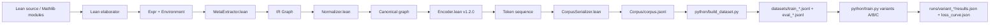

# Maith: Semantic IR for Lean Mathematics

Maith is a Lean 4 project for extracting a canonical semantic representation of formal mathematics from elaborated Lean terms (`Expr`), then serializing that representation into token sequences for downstream language-model training.

## 1) Research Question

Can language models become better theorem provers if trained on a representation of mathematics that exposes semantic structure rather than source syntax?

## 2) Hypothesis

Our central hypothesis is that language models trained on a canonical semantic representation of formal mathematics — rather than raw proof assistant source code — will learn more useful mathematical representations, resulting in improved theorem prediction, proof search, and proof completion.

Maith is a **candidate representation** for testing that hypothesis; effectiveness is not assumed and remains to be demonstrated empirically.

## 3) Why This Matters

Recent progress in automated theorem proving with language models has focused heavily on model scale and data quantity. We hypothesize that representation choice is also a major bottleneck: if training data exposes semantic structure more directly, models may need less capacity to learn equivalent mathematical patterns. Maith exists to make that hypothesis testable in a Lean/Mathlib setting.

## 4) Approach

Maith does **not** parse Lean source strings into IR. Instead, it runs inside Lean and extracts IR from the elaborated environment (`Environment`, `ConstantInfo`, `Expr`), where implicit arguments, notation expansion, and typing information are already resolved.

High-level flow:

- Extract declaration semantics from elaborated `Expr` trees (`MetaExtractor.lean`)
- Build IR Graph (`Entity`, `Attribute`, `Relation`, `Operation`)
- Canonicalize graph ordering (`Normalizer.lean`)
- Encode canonical graph to tokens (`Encoder.lean`) — v1.2.0, `FVAR_N`/`BVAR_N`/`TERM_N` positional tokens
- Serialize examples to JSONL (`CorpusSerializer.lean`)
- Consume JSONL in `python/` for vocab/tokenizer, splits, and dataset objects

The full pipeline is implemented and validated end-to-end: 2,554/2,554 declarations round-trip cleanly through encode → decode (see `python/validate_roundtrip.py`), confirming token/graph losslessness; this does not include reconstruction back to Lean syntax, which is not yet implemented. Encoder v1.2.0 distinguishes forall binders (`FVAR_N`) from lambda binders (`BVAR_N`).

## 5) Why Not Train Directly on Lean Source?

This section is motivation, not a claim of proven superiority.

We hypothesize that source-token training may be less sample-efficient because:

- Lean notation can hide semantic equivalences that elaborate to similar terms.
- Elaboration inserts implicit arguments that are absent in surface syntax.
- Macros and coercions can map many textual forms to related elaborated structures.
- Multiple syntactic encodings of the same idea may collapse into a smaller set of semantic patterns after elaboration.

We expect a canonical semantic representation to be easier for sequence models to learn from than raw source in at least some theorem-prediction/proof-search settings, but this remains to be tested.

## 6) Architecture


```mermaid
flowchart LR
    A[Lean source / Mathlib modules] --> B[Lean elaborator]
    B --> C[Expr + Environment]
    C --> D[MetaExtractor.lean]
    D --> E[IR Graph]
    E --> F[Normalizer.lean]
    F --> G[Canonical graph]
    G --> H[Encoder.lean v1.2.0]
    H --> I[Token sequence]
    I --> J[CorpusSerializer.lean]
    J --> K[Corpus/corpus.jsonl]
    K --> L[python/build_dataset.py]
    L --> M[datasets/train_*.jsonl + eval_*.jsonl]
    M --> N[python/train.py variants A/B/C]
    N --> O[runs/variant_*/results.json + loss_curve.json]
```

Concrete pipeline in this repo:

`Lean environment -> MetaExtractor.lean -> IR Graph -> Normalizer.lean -> canonical graph -> Encoder.lean -> token sequence -> CorpusSerializer.lean -> corpus.jsonl -> python/`

For a fuller, stage-by-stage architecture and artifact map, see:
[`docs/Design.md#detailed-pipeline-diagram`](docs/Design.md#detailed-pipeline-diagram).

The full pipeline is implemented and validated. See section 7 for corpus results and section 8 for known limitations.

## 7) Current Status / Results

### Build and tests

- `lake build tests` passes (0 failures).
- All tests pass (**66+ unit tests + corpus-pipeline/serializer integration checks**).

### While full A/B/C runs are active

Use these read-only monitoring helpers (safe during active training):

```bash
python3 python/run_status_dashboard.py
python3 python/watch_full_runs.py
python3 python/estimate_full_run_eta.py
python3 python/full_run_status_snapshot.py
python3 python/full_run_status_report.py
python3 python/full_run_status_history.py
```

To guard against stale experiment values in docs while results evolve:

```bash
python3 python/check_docs_consistency.py
```

After runs complete, check publish readiness in one command:

```bash
python3 python/check_publish_readiness.py --runs-dir runs/
```

Validate key artifact schemas:

```bash
python3 python/validate_experiment_artifacts.py --runs-dir runs/
```

Run the full post-run publication pipeline:

```bash
python3 python/run_postrun_pipeline.py --runs-dir runs/
```

Phase 5 artifact field contracts and Phase 6 scaffold designs are documented in [`docs/FUTURE_WORK.md`](docs/FUTURE_WORK.md).

Canonical experiment assumptions/interpretation decisions are tracked in
[`docs/DECISION_LOG.md`](docs/DECISION_LOG.md).

### Corpus extraction result (real run)

4 modules: `Mathlib.Algebra.Group.Defs`, `Mathlib.Algebra.Group.Basic`, `Mathlib.Algebra.Ring.Defs`, `Mathlib.Order.Basic`  
Total declarations: **2,554**

| Module | Declarations | Success |
|---|---|---|
| Algebra.Group.Defs | 1,129 | 1,129 (100%) |
| Algebra.Group.Basic | 548 | 548 (100%) |
| Algebra.Ring.Defs | 446 | 446 (100%) |
| Order.Basic | 431 | 431 (100%) |
| **Total** | **2,554** | **2,554 (100%)** |

All previously identified failure categories have been resolved — zero failures across all four modules.

Token distribution (encoder v1.2.0): min 13, max 13,253, avg 324, total ~39M tokens.  
After pathological filter (>50 TERM_MANY): 2,459 training examples, max sequence 1,264 tokens.  
Graph stats: avg 35.8 entities, 13.5 relations, 22.3 operations per graph, max 3,142 nodes.  
Unique vocab (IR): 7,867 tokens (4,495 after filtering to training split).

Non-trivial extracted examples:

| Declaration | Entities | Relations | Operations |
|---|---|---|---|
| `mul_assoc` | 11 | 5 | 5 |
| `mul_comm` | 8 | 4 | 3 |
| `mul_one` | 11 | 3 | 6 |
| `DivisionMonoid.mk` | 34 | 14 | 21 |

Evidence artifact committed intentionally: [`Corpus/corpus.jsonl`](Corpus/corpus.jsonl) (current 7.2MB extraction output for the module above).

### Binder encoding (encoder v1.2.0)

Lean uses De Bruijn indices for bound variables. Maith uses positional tokens assigned in
first-appearance order within each graph:

- Forall binders (`∀x, ...`) → `FVAR_0`, `FVAR_1`, ... (cap 63, overflow → `FVAR_MANY`)
- Lambda binders (`fun x => ...`) → `BVAR_0`, `BVAR_1`, ... (cap 63, overflow → `BVAR_MANY`)

Each counter resets to 0 per graph. Scoped names (`∀:declName/depth/x`) are used internally
during extraction to prevent cross-declaration collisions, then mapped to positional tokens by
the encoder. Round-trip verified 2,554/2,554 via `validate_roundtrip.py`.

## 8) Limitations

- Validated across 4 Mathlib modules so far. Broader coverage (more modules, tactic-heavy declarations) may surface new `Expr` patterns.
- Phase 5 matched-batch rerun complete (2026-07-28): A=1.39, B=1.15, C=1.13, all `smoke_test: false`,
  all variants effective batch=8. DEC-007 (unmatched batch sizes) is resolved; the A/B/C gap holds.
  DEC-006 (random embedding init for A vs pretrained embeddings for B/C) is the remaining confound.
  A 3-epoch A run is the next step to rule it out before interpreting perplexity differences as
  hypothesis evidence.
- For the current authoritative experiment state, use:
  - `docs/DECISION_LOG.md` (DEC-006, DEC-007)
  - `python3 python/compare_results.py --runs-dir runs/`
- `Transpiler.lean` is debug-only: its `formatEntityId` output format differs from `Encoder.lean` and is not in the training pipeline. It is retained as a human-readable diagnostic tool only.

## 9) Research Roadmap

1. **Phase 1: Build semantic IR** — ✅ done
2. **Phase 2: Extract Mathlib corpus** — ✅ done (2,554 declarations, 4 modules, 100% coverage)
3. **Phase 2.5: Stable encoder format + vocab** — ✅ done (v1.2.0, 7,867 tokens, FVAR/BVAR split, decoder round-trip 2554/2554)
4. **Phase 3: Build token vocabulary + dataset** — ✅ done (`python/build_dataset.py`, A/B/C splits, `vocab_A.json`)
5. **Phase 4: Tokenizer fragmentation study** — ✅ done (1.69x BPE inflation on Lean source)
6. **Phase 5: Run A/B/C training experiment** — 🔄 confound-elimination in progress. Matched-batch rerun complete (2026-07-28: A=1.39, B=1.15, C=1.13). DEC-008 complete: 3-epoch A=1.26 (cold-start is real but partial). DEC-009 in progress: embedding warm-start to fully isolate representation quality.
7. **Phase 6: Measure theorem-proving performance** — not started

Representation contingency planning and Phase 6 design notes are in [`docs/FUTURE_WORK.md`](docs/FUTURE_WORK.md).

Remaining IR milestones with current size estimates:

All previously identified failure categories have been resolved:
- ✅ **HOF application** (`bvar`/`fvar` as function head): fixed, emits `gen:hof` operation
- ✅ **Projection expressions (`.proj`)**: fixed, emits `gen:proj:TypeName/idx` operation
- ✅ **`letE` support**: fixed, pushes scoped bound entity and recurses into body
- ✅ **Heterogeneous `Eq` arity**: fixed, `HEq` handled explicitly; other arities fall back to generic operation

## 10) Evaluation Plan

The core hypothesis will be tested by training and comparing models on:

1. Lean source tokens
2. Lean AST serialization
3. Maith semantic IR tokens

Candidate metrics (planned):

- Next-token prediction quality
- Proof completion performance
- Automated theorem-proving success rate
- Proof-search efficiency (time/steps)
- Embedding quality for mathematical similarity/retrieval

Next-token prediction (Phase 5) has a completed full run; see limitations section for documented confounds before interpreting results. Theorem-proving evaluation (Phase 6) is not started; current evidence is extraction feasibility/coverage and next-token perplexity, not downstream proving performance.

## 11) Building the Project

```bash
git clone <repo-url>
cd Maith
lake build tests
./.lake/build/bin/tests
```

To run the corpus build:

```bash
cd Maith
lake build buildCorpus
lake env ./.lake/build/bin/buildCorpus
```

Outputs are written under `Corpus/`:

- `Corpus/corpus.jsonl`
- `Corpus/stats.json`
- `Corpus/logs.txt`

This repository currently tracks these corpus artifacts intentionally so readers can inspect real output directly.

## 12) Repository Structure

```text
Maith/
  MetaExtractor.lean       # elaborated Lean Expr -> IR graph
  EntityId.lean            # includes EntityId.bound for scoped binders
  Normalizer.lean          # canonical ordering/normalization
  Encoder.lean             # graph -> token sequence (v1.2.0, FVAR_N/BVAR_N/TERM_N positional)
  Decoder.lean             # token -> graph parser (v0.1.0 + v1.0.0 + v1.2.0 backward compat)
  Transpiler.lean          # debug-only: human-readable IR formatter, not in training path
  CorpusSerializer.lean    # JSONL/stat serialization
  ProcessingPipeline.lean  # extraction + normalize + encode flow
  MathlibCorpusBuilder.lean
  ...
Tests/
  CorpusPipelineTests.lean
  InjectivityTests.lean
  DecoderTests.lean
  EncoderTests.lean
  ...
python/
  corpus_loader.py         # schema validation, loading, vocab build, split, dataset class
  build_dataset.py         # A/B/C dataset builder: IR vocab + BPE variants, train/eval splits
  train.py                 # fine-tuning script: one variant per run, reports eval perplexity
  compare_results.py       # prints A/B/C comparison table from runs/variant_*/results.json
  validate_roundtrip.py    # decoder round-trip validator (confirms BVAR/TERM stability)
  tokenizer_study.py       # BPE fragmentation study vs Qwen2.5-Coder
  spot_check.py            # manual corpus spot-checking helper
docs/
  Design.md                # architecture and design decisions
  ENCODER_FORMAT.md        # canonical token format spec (v1.2.0)
  EXPERIMENT_DESIGN.md     # A/B/C experiment design and results
  DECISION_LOG.md          # experiment decisions and confound documentation
  EXAMPLE_ROUNDTRIP.md     # full pipeline walkthrough for neg_neg
  PHASE_5_RESULTS.md       # Phase 5 results (matched-batch rerun complete 2026-07-28)
  CORPUS_PIPELINE_STATUS.md
  PYTHON_PIPELINE.md       # python/ tooling reference
  TESTING_SUMMARY.md       # test suite status
  LATEST_FIXES.md          # recent session fixes (last 2 sessions)
  CHANGELOG.md             # older fix history
  SESSION_PROGRESS.md      # full session-by-session development log
  REPRESENTATION_EVOLUTION.md  # IR candidate evolution strategy
  FUTURE_WORK.md           # Phase 6+ scaffold designs (not yet implemented)
  TEST.md                  # test run commands
README.md
CORPUS_SCHEMA.md           # JSONL schema contract
```

## 13) License

This project is licensed under the MIT License. See [LICENSE](LICENSE).
