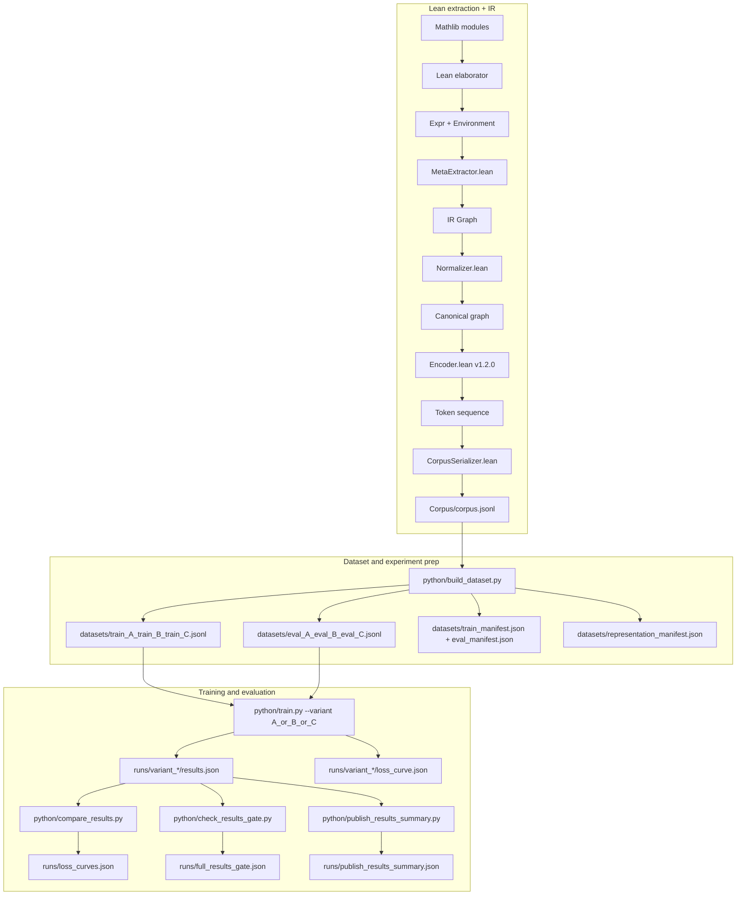

Design Notes
============

These notes document the architectural reasoning behind the Lean‑based transformer‑centric IR. They explain why each layer exists, how the components interact, and what constraints shaped the design.

## Why Semantic IR?

The core research question: **Can language models become better theorem provers if trained on a representation of mathematics that exposes semantic structure rather than source syntax?**

Maith tests this by comparing three representations:
- **A (IR):** Maith's semantic graph → tokens (one candidate IR)
- **B (source):** Raw Lean source → BPE tokens
- **C (AST):** Lean elaborated type → AST-style → BPE tokens

The IR is designed to expose semantic structure that source syntax hides—canonical forms, resolved implicits, typeclass instances—so models can learn mathematical patterns more directly.

**Note:** Maith's IR is one *candidate* representation. The hypothesis is that *some* semantic representation helps; other IR designs (different abstraction levels, noise reduction, etc.) could also be explored.

## Extraction Architecture

Maith extracts IR directly from Lean's elaborated environment — not from source strings.
`MetaExtractor.lean` walks `ConstantInfo`/`Expr` trees from the live `Environment`, where
implicit arguments, notation expansion, typeclass resolution, and macro expansion are already
resolved. This is the only extraction path; no string-based Lean parser exists in the codebase.

The high-level flow is:

```
Lean Environment → MetaExtractor.lean → IR Graph → Normalizer.lean → canonical graph
  → Encoder.lean (v1.2.0) → token sequence → CorpusSerializer.lean → corpus.jsonl
  → python/ → A/B/C dataset variants → fine-tuning
```

## A/B/C variant definitions (current experiment)

The Lean extraction/encoding path above produces the canonical IR corpus once, then `python/build_dataset.py`
materializes three training variants:

- **Variant A (IR representation):** encoded Maith IR tokens (`Encoder.lean` v1.2.0) with a custom vocab
  (`vocab_A.json`), and resized embedding/unembedding layers to that vocab size.
- **Variant B (raw-syntax baseline):** raw `leanExpr` text tokenized by native Qwen2.5-Coder BPE.
- **Variant C (AST-style baseline):** AST-style tokenized `leanExpr` (split form), also tokenized by native
  Qwen2.5-Coder BPE.

So B and C intentionally share the same tokenizer family but differ in input representation. C is **not**
"B with a different sequence cap"; eval perplexity is computed with the same fixed eval cap across A/B/C
for apples-to-apples comparison.

## Detailed pipeline diagram



`Transpiler.lean` provides bidirectional IR↔string conversion:
- **Encoder**: formats IR as human-readable string for debugging (uses `var:/term:/bound:` prefixes)
- **Decoder**: parses token sequences back to IR graphs (lossless round-trip verified for 2,554 declarations)
- **Decompiler**: reconstructs valid Lean syntax from IR graphs (implemented via `Decompile.decompileGraph`)

The decompiler enables verifying SLM outputs and supports safe rewriting workflows.

---

Core Principles
---------------

### **1\. Transformers prefer structure over syntax**

Lean syntax is optimized for humans. Transformers prefer:

*   fixed vocabularies
    
*   predictable token boundaries
    
*   shallow nesting
    
*   reversible structure
    
*   uniform patterns
    

The IR is designed to minimize entropy and maximize locality.

### **2\. Reversibility is non‑negotiable**

Every IR token must map back to a Lean construct. This ensures:

*   round‑trip correctness
    
*   verifiable SLM outputs
    
*   safe rewriting

The token↔graph direction of this round-trip is implemented and verified
(2,554/2,554 declarations pass `validate_roundtrip.py`). The graph→Lean-syntax
direction — reconstructing valid Lean from an IR graph — is now implemented via
`Transpiler.lean`'s `Decompile.decompileGraph` function. This enables verifiable
SLM outputs and supports safe rewriting workflows.

The decompiler handles:
- Forall binders with implicit/instance-implicit/explicit kinds
- Typeclass instances
- Sort annotations (Type.{u})
- Arithmetic operations (neg, add, sub, mul, div, pow)
- Generic operations (gen:<name>)
- Equality relations
- Nested forall structure
    

### **3\. Graphs are the universal representation**

Math expressions, proofs, and definitions all reduce to graphs. Graphs provide:

*   explicit dependency structure
    
*   typed edges
    
*   uniform encoding
    
*   transformer‑friendly traversal
    

DSL Design
----------

The DSL is intentionally minimal. It avoids:

*   syntactic sugar
    
*   implicit coercions
    
*   overloaded notation
    

Instead, it uses:

*   explicit polarity
    
*   explicit operators
    
*   explicit entity IDs
    

This makes the DSL predictable for both humans and models.

IR Vocabulary
-------------

The IR vocabulary is small, canonical, and stable. Encoder v1.2.0 produces:

- **Structural tokens**: `GRAPH_BEGIN`, `GRAPH_END`, `E`, `A`, `R`, `O`, polarity markers
- **Forall binder IDs**: `FVAR_0`–`FVAR_63`, `FVAR_MANY` (forall/∀ binders, counter resets per graph)
- **Lambda binder IDs**: `BVAR_0`–`BVAR_63`, `BVAR_MANY` (lambda/fun binders, counter resets per graph)
- **Positional term IDs**: `TERM_0`–`TERM_63`, `TERM_MANY` (replaces `t<n>` strings)
- **Semantic constants**: `HMul.hMul`, `Eq`, etc. (stable across corpus)
- **Generic operations**: `gen:<FullName>` (rare ones map to `GEN_UNK` at dataset-build time)

Known tradeoff: when a declaration exceeds 64 distinct forall/lambda binders in a graph, additional binders
collapse into `FVAR_MANY`/`BVAR_MANY`, which preserves bounded vocab size but loses positional distinctness
beyond index 63.

Full specification: `docs/ENCODER_FORMAT.md`.

Current corpus vocabulary: **7,867 unique tokens** across 2,554 declarations (4 modules).
Training vocab (after pathological filter): **4,495 tokens**.

Encoding Strategy
-----------------

The encoder (`Encoder.lean`) produces token lists from a full graph in one pass:

1. Build a BVAR/FVAR map: walk all entity IDs in order. For each new `EntityId.bound` scope,
   assign `FVAR_N` if the scope starts with `∀:` (forall binder) or `BVAR_N` if `λ:` (lambda).
   Each counter starts at 0 per graph. This ensures positional consistency within a graph.
2. Encode entities, attributes, relations, and operations using the map.
3. Wrap with `GRAPH_BEGIN` / `GRAPH_END`.

Tokens are designed for next-token prediction. The positional encoding means structurally
identical graphs from different declarations produce identical token sequences — declaration-name
noise is removed by design.

Decoding Strategy
-----------------

The decoder (`Decoder.lean`) reconstructs IR graphs from token lists. It is total: unknown
tokens are skipped, missing `GRAPH_BEGIN` returns an empty graph rather than a panic.

Supports v1.2.0 (`FVAR_N`/`BVAR_N`/`TERM_N`), v1.0.0 (`BVAR_N`/`TERM_N`), and v0.1.0 legacy (`b(...)`/`t<n>`) formats. Round-trip verified 2,554/2,554.

In v1.0.0, forall and lambda binders were not split into separate token families; both used `BVAR_*`.
v1.2.0 introduced the explicit `FVAR_*` vs `BVAR_*` distinction. Current corpus/training artifacts use v1.2.0;
older decode support remains for backward compatibility and regression testing.


Rewrite Engine Philosophy
-------------------------

This section is architectural direction, not a fully built standalone module in the current pipeline.
Today, canonicalization/normalization is implemented (via `Normalizer.lean`), but a broader rewrite engine
with probabilistic or search-integrated rewrite policies is still future work.

Target rewrite behavior operates on graphs, not syntax. This enables:

*   algebraic simplification
    
*   structural normalization
    
*   symbolic reasoning
    

Rewrites must be:

*   deterministic
    
*   terminating
    
*   composable
    

Future Directions
-----------------

*   richer operator vocabularies
    
*   probabilistic rewrite rules
    
*   SLM‑driven autocompletion
    
*   VS Code integration
    
*   IR‑native proof search
    

These notes serve as the conceptual backbone of the project, guiding future contributors and ensuring architectural consistency.