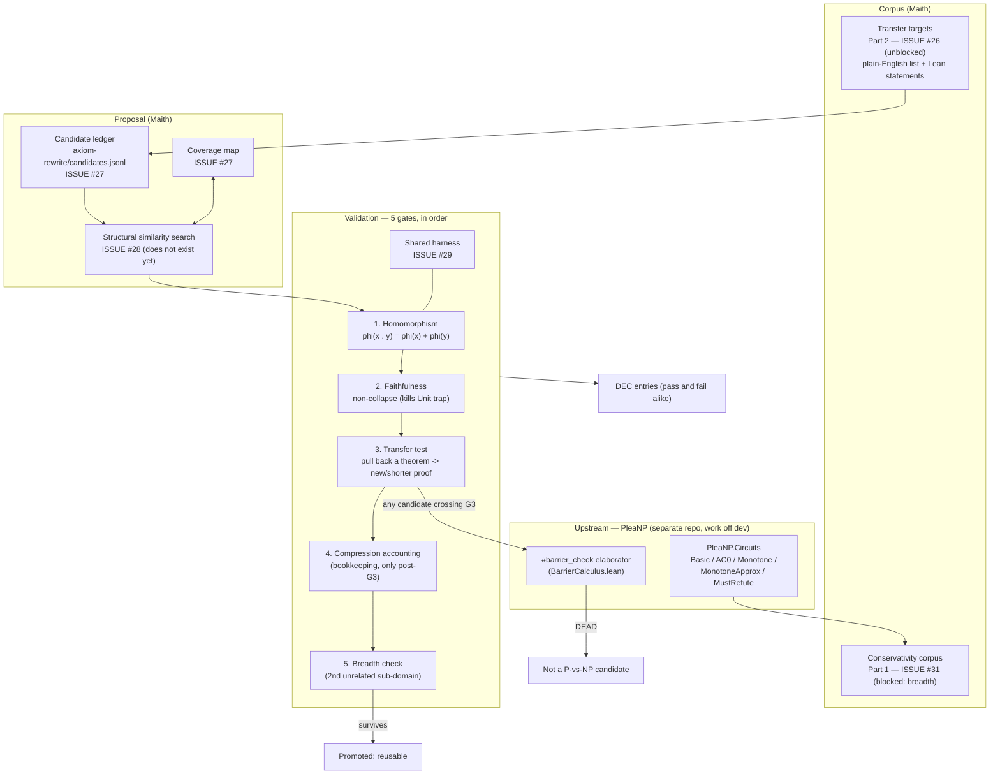

# Axiom Discovery: Searching for Compressive Foundations

## Status

Active track, superseding the toy-model training path. (The original text
attributed the "shelved" decision to a `DIRECTION.md`; no such file exists in
this or any sibling repo — see "Reconciliation note" below. The shelving is
recorded in `README.md` §9 and DEC-036.) Toy-model training remains shelved.
This document promotes a speculative "AI-authored axiom systems via a
metaprogrammed DSL" idea to an active, narrowed, operationalized track.

## Reconciliation note (2026-09-15)

This document was written against infrastructure that does not all exist. Before
acting on any step below, note what was verified on 2026-09-15:

| Claim in this document | Verified reality |
|---|---|
| "Structural similarity search (subgraph isomorphism / graph edit distance / structural fingerprinting) — originally built as a proof-candidate generator (DIRECTION.md). Reused here..." | **Does not exist.** `Maith/GraphEquivalence.lean` is exact structural/normalized/rewrite *equality* (a test helper, referenced only by `Init.lean`), not a similarity search. There is no subgraph-isomorphism, graph-edit-distance, or fingerprinting code anywhere in the repo. **This must be built**, so the "nothing here is being rebuilt" framing is wrong for this item. |
| "HOF application support / projection expression parsing — still the highest-priority extraction gaps... remains the actual blocking dependency." | **Implemented and passing.** `Maith/MetaExtractor.lean` handles variable-headed application (`hof`) and `.proj`; `Tests/CorpusPipelineTests.lean::testHOFApplicationExtracts` / `testProjectionExtracts` pass. (The inline code comment in `MetaExtractor.lean` saying they are "NOT covered" is itself stale — a branch immediately below covers them.) This is **not** the blocking dependency; see the actual one below. |
| "complexitylib / descriptive-complexity (external, once toolchain reconciliation in PleaNP issue #70 lands) — source of the circuit complexity benchmark corpus." | **Superseded.** PleaNP #70 closed 2026-09-13 **rejecting** the `complexitylib` import (it pins `v4.34.0-rc2` + `cslib` vs PleaNP's stable `v4.31.0`), and chose a local `PleaNP.Circuits`. That module now exists and is materially further along than "stub" (five type-checking modules on PleaNP `dev`: `Basic`, `AC0`, `Monotone`, `MonotoneApprox`, `MustRefute`), though it is concentrated in one area. See `BENCHMARK_CORPUS_PLAN.md` §Dependencies. |
| "the toy-model training loop and harness (moved to `archive/`, not deleted)" | **No `archive/` directory exists.** The toy-model scripts (`train.py`, `train_h5_*`, `train_h9_*`, `train_v2_resume.py`) are still live and referenced by `python/manage.py` and `python/launch_run.py`. The shelving is a *research-direction* decision, not a filesystem move. |
| "DIRECTION.md" (3 references) | No `DIRECTION.md` in Maith, PleaNP, muse, or philharmonic. |
| "Decision log (DEC-001 through DEC-024+)" | The log now runs to DEC-036. |
| PleaNP's `#barrier_check` elaborator | **Exists and is real** — `lean/PleaNP/Calculus/BarrierCalculus.lean` (Rung 5). This integration point is valid. |

**Actual blocking dependency:** the circuit-complexity *substrate* for the
benchmark corpus. `PleaNP.Circuits` is a stub listing planned coverage; the
lower-bound library is still being built upstream (e.g. PleaNP #72, parity ∉
AC⁰). Per `BENCHMARK_CORPUS_PLAN.md`, Part 2 (transfer targets) can start now;
Part 1 (conservativity corpus) is blocked until that library is broad enough to
pass its own breadth check.

## What we're actually testing

Not "can we solve P vs NP." The falsifiable, near-term claim is:

> Can we find a map φ from a domain of interest (initially: circuit complexity
> objects and proofs) into an existing, well-understood algebraic structure,
> such that φ is a genuine homomorphism, φ is non-trivial (not a collapse),
> and pulling existing theorems about the target structure back through φ
> produces new or substantially shorter proofs in the source domain?

Success is measured in kernel-checked theorems and proof-term size, not in
entropy scores, vibes, or resemblance to historical notation wins. Entropy and
"fractal compressibility" are heuristics for *where to look*, never a
substitute for the homomorphism-and-transfer result itself.

P vs NP relevance, if any, is something we notice after a real result exists —
never the stated target of a search step. See "Non-goals" below.

## Existing infrastructure we reuse (nothing here is being rebuilt)

- **IR extraction pipeline / `corpus.jsonl`** — already parses Mathlib
  declarations into the semantic IR graph. This is the substrate for
  everything below; no changes needed to reuse it for a narrower domain
  (circuit complexity declarations instead of arbitrary Mathlib).
- **Structural similarity search** (subgraph isomorphism / graph edit distance /
  structural fingerprinting over the IR graph) — **not present; must be built.**
  This is the literal search mechanism over candidate target structures and
  candidate φ mappings. The original text described it as already existing as a
  proof-candidate generator; it does not (see the reconciliation note above).
  Note the distinction from `Maith/GraphEquivalence.lean`, which is exact
  *equality* for testing, not similarity ranking.
- **HOF application support / projection expression parsing** — **done** (not a
  gap). `MetaExtractor.lean` covers both; `Tests/CorpusPipelineTests.lean`
  passes `testHOFApplicationExtracts` / `testProjectionExtracts`. The load-bearing
  open question is *coverage* over real circuit-complexity declarations, which the
  coverage map (below) is designed to answer.
- **Decision log** (now DEC-036) — continue in the same format. Every candidate
  structure gets a DEC entry, pass or fail; negative results are logged with the
  same weight as positive ones, per the project's existing norm.
- **`lake build` as sole oracle** — unchanged, non-negotiable, carried over
  from every prior document. No claim is accepted on model confidence,
  similarity score, or human intuition alone.
- **PleaNP's `#barrier_check` elaborator** (external repo, same author) —
  verified to exist at `lean/PleaNP/Calculus/BarrierCalculus.lean`. Once a
  candidate φ produces a transferred theorem in circuit complexity, run it
  through `#barrier_check` before treating it as interesting. This is the
  concrete integration point between the two projects: Maith generates candidate
  techniques, PleaNP screens them for relativization.
- **`PleaNP.Circuits`** (external, PleaNP) — source of the circuit-complexity
  benchmark corpus. On PleaNP's `dev` branch it holds five type-checking modules
  (`Basic`, `AC0` incl. the unproved `parity_notin_AC0` statement, `Monotone`,
  `MonotoneApprox`, `MustRefute`), so a first transfer test has real content.
  It is concentrated in circuit complexity, so Part 1's breadth requirement is
  not yet met (issue #31); Part 2 is unblocked. See
  `BENCHMARK_CORPUS_PLAN.md` §Dependencies. We are not re-deriving circuit
  infrastructure ourselves.

**Retiring the toy-model loop is a research-direction decision, not a filesystem
move.** No `archive/` directory exists or is being created. The toy-model scripts
remain in place and wired into `manage.py`; they are simply no longer the active
track (README §9, DEC-036).

## Candidate spec (record shape)

A candidate is a small, structured **spec** — data, not code, and not encoded in
the IR. (The heading here is "spec", not "representation": a candidate is not a
representation, and the word carries a specific meaning elsewhere — see below.)

- **Target structure**: an existing Mathlib type/structure (group, lattice,
  category, module, etc.), or a novel self-referential structure (see
  "Recursive/fractal candidates" below).
- **Domain**: the benchmark subset of circuit-complexity declarations the
  candidate is being tested against.
- **φ definition**: the proposed structure-preserving map, expressed as a
  real Lean definition (not just a claim).
- **Provenance**: how the candidate was proposed (search heuristic used,
  seed, or model prompt) — logged for reproducibility and later analysis
  of which proposal strategies are actually productive.

### Two jobs, two substrates

The track uses two different substrates for two different jobs. Conflating them is
the most likely source of a wrong implementation of #28/#29:

| Job | Substrate | Why |
|---|---|---|
| **Propose** — find candidate φ's | **The IR** (structural fingerprinting / subgraph matching over `corpus.jsonl`) | Similarity search needs an indexable, comparable object. That is what the IR is for. |
| **Validate** — run the five gates | **Metaprogramming** (`infer_instance`, elaboration, `#print axioms`) | The gates are Lean obligations; they can only be discharged by elaborating real terms. |

So: a candidate's **φ is ordinary Lean**, not IR and not metaprogrammed — a
homomorphism is a type-theoretic statement, and an IR token sequence cannot state
one. The **search consumes the IR** to *find* candidates; the **harness uses
metaprogramming** to *validate* them. The design pattern that makes this work is
that φ is written normally but discharged by instance search — the same mechanism
`#barrier_check` already uses (`infer_instance` walking the `Relativizing` graph).

> **IR-mode caveat for structural search (#28).** The default extraction mode
> (`BucketMode.module`) collapses operator identity: `genericOpToken` returns
> `bucketFromModule st` (`Maith/MetaExtractor.lean:137–141`), and
> `bucketFromModule` (`:111`) maps by *declaration module*, so distinct operators in
> one module become the same token. `python/test_c4_bucketing.py::test_gen_tokens_share_bucket`
> asserts exactly this: `gen:Foo`, `gen:Bar.Baz`, `gen:Quux` under `Mathlib.Algebra.Ring.Defs`
> all encode to `GEN_ALGEBRA`.
>
> Consequence: **structural similarity over the default IR matches shape but not
> which operation.** For candidate discovery that is a silent quality loss — two
> graphs differing only in operator identity look identical. The search (and any
> corpus prepared for it) must use `--per-operator`
> (`genericOpToken ... .per_operator => s!"op:{headName}"`, `:140`), which preserves
> per-operator identity (DEC-028). Note also that `FVAR_N`/`BVAR_N`/`TERM_N` indices
> are local per graph (`GLOSSARY.md`), so they support shape matching but cannot
> establish cross-graph identity.

One shared metaprogramming harness (in a new `axiom-rewrite/` directory — **not**
a long-lived branch; Maith works on the single `dev` branch per DEC-036) consumes
these specs uniformly. Do not write a new elaborator or DSL implementation per
candidate — only the spec changes.

## The pipeline (how the pieces connect)

Reading it: **targets and corpus come from upstream PleaNP** (real, type-checking
`PleaNP.Circuits` modules — five verified 2026-09-15); Maith **proposes** candidate
φ's (recorded in the ledger, biased by the coverage map, found via the similarity
search); the **shared harness** runs them through the five gates; anything crossing
the transfer gate goes through `#barrier_check` before it counts. The toy-model
training loop is not in this diagram — it is shelved (DEC-036).

Three things the diagram makes visible that the prose buries:

1. **#28 (similarity search) is a real build, not reuse.** The original doc claimed
   it already existed as a proof-candidate generator; it does not.
2. **The corpus has two halves with different status.** Part 2 (targets) is
   unblocked; Part 1 (conservativity) is blocked on *breadth*, not existence.
3. **Gate 4 is downstream of gate 3 by design** — it can never rescue a candidate
   that failed the transfer test.

## Validation pipeline (gates, in order — each is a real Lean obligation)

1. **Homomorphism obligation.** Prove φ(x ∘ y) = φ(x) ⊕ φ(y) for the
   relevant operation pairs. Fails to typecheck → candidate dead, no
   partial credit.
2. **Faithfulness / injectivity check.** Prove or characterize φ's kernel
   on the benchmark domain. Rules out the Unit-collapse degenerate case:
   a φ that's vacuously a homomorphism by collapsing everything is
   rejected here, not treated as a weak positive.
3. **Transfer test.** Pull back an existing theorem about the target
   structure through φ. Must typecheck as a statement about the source
   domain, and must be either new or a strictly shorter proof of a known
   result. This is the actual result-producing step; steps 1-2 are purely
   admission control.
4. **Compression accounting.** Record proof-term size (or IR-graph node
   count) for the benchmark theorem set before and after. This is
   bookkeeping on a result that already exists after step 3 — never used
   to justify a candidate that failed steps 1-3.
5. **Breadth check.** Repeat against a second, unrelated benchmark
   sub-domain. A φ (or generating pattern) that keeps transferring across
   multiple sub-domains is the actual "fractal" signal: a small generator
   paying off at multiple scales. A one-off hit is logged but not treated
   as validated infrastructure until it replicates.

Only candidates surviving step 3 get a compression number recorded. Only
candidates surviving step 5 get promoted to "reusable" and considered for
integration into the shared corpus.

## Tracking candidates and search space

- **Candidate ledger** (`axiom-rewrite/candidates.jsonl`) — **built** (issue #27;
  see `axiom-rewrite/README.md`). One record per candidate: the spec, which gate it
  passed/failed, compression numbers when applicable, and provenance. Append-only —
  failed candidates are kept, not deleted, so the search history itself becomes data.
  Two gate rules from §"Validation pipeline" are **enforced on append** (compression
  requires gate 3; `reusable` requires gate 5), and validated by mutation-tested
  fixtures.
- **Coverage map over the benchmark domain** — **built** (issue #27), *derived* from
  the ledger rather than stored, so it cannot drift: per benchmark declaration, how
  many candidate φ's have been tried and with what outcome. Passing the full
  benchmark list (`coverage --domains <file>`) shows declarations with **zero
  attempts** first, which is what biases proposal toward under-explored
  declarations rather than re-testing the same easy wins.
- **DEC log entries** for anything crossing gate 3 (a real result) or
  anything informative about the search process itself (a proposal
  strategy that's consistently unproductive is as worth recording as one
  that works).

## The output: promoted structure (schema only — do not build yet)

The track's actual product is not a candidate. Chasing the definitions in this
document to their end:

- It is **not the φ** — φ is a map, and it maps into an *existing* structure.
- It is **not a candidate** — candidates are disposable probes; the ledger keeps
  them "so the search history itself becomes data."
- It **is the promoted structure**: the object gate 5 produces when a φ (or
  generating pattern) transfers *and* replicates across a second, unrelated
  sub-domain. The document's own word for the surviving signal is "reusable …
  fractal: a small generator paying off at multiple scales" — a *generated
  structure*. That is the new representation, and it is GCT's shape.

**This is a real gap in the current design:** gate 5 says a survivor is "promoted
to reusable," but nothing defines the record that promotion produces. The
candidate ledger stores per-candidate outcomes; nothing stores the *pattern
across* candidates — which is the thing that is the representation. Candidate
discovery can proceed without it, but #30's first successful candidate would have
nowhere to go.

**Schema (definition only).** A promoted-structure record should carry:

| Field | Meaning |
|---|---|
| `promoted_id` | Stable identifier for this promoted structure |
| `derived_from` | The candidate-φ ids that exhibited the pattern |
| `generator` | The small generating rule that reproduces structure across scales |
| `target_structure` | What it maps into |
| `domains_replicated` | The ≥2 unrelated sub-domains gate 5 required (the evidence for "reusable") |
| `transfer_results` | The kernel-checked transferred theorems produced (the results it rests on) |
| `barrier_verdicts` | `#barrier_check` outcome(s) for those results |
| `compression` | Recorded only if gate 3 passed (bookkeeping, never validation) |

Where it lives is deliberately left open: an extension of the candidate ledger, or
a sibling `axiom-rewrite/promoted.jsonl`. Both work; pick one when there is
something to put in it.

> **Scope discipline (deliberate).** **Define the schema; do not build tooling
> around it.** No candidate has survived even gate 3 yet, so a promoted-structure
> subsystem would be exactly the failure this document's reconciliation note
> corrects — describing infrastructure before anything exists to put in it. Build
> it when #30 actually produces a survivor that needs a home.

## Targeting domains: circuit complexity first, and why

Per the earlier discussion of GCT's architecture: an unaimed, domain-general
compression search is a much weaker signal than one aimed at a domain with
known structural richness and an existing target problem. Circuit
complexity is chosen specifically because:

- It has characterized barrier classes (relativizing, natural, algebrizing)
  against which any transferred technique can be mechanically screened
  (via PleaNP's `#barrier_check`), giving a concrete, checkable notion of
  "is this technique even a candidate" beyond compression alone.
- complexitylib / descriptive-complexity provide an existing, importable
  corpus (machine models, Cook-Levin, circuit basics) rather than
  requiring us to formalize the domain from scratch.
- GCT is the closest real precedent (new representation-theoretic
  structure aimed explicitly at a circuit lower bound) and gives an
  explicit template: don't just search for compression, require an
  articulated argument (ideally itself a checkable claim) for why a
  surviving candidate might evade the known barrier classes.

## Favoring homomorphic and fractal/recursive candidates

Two proposal heuristics, used to bias search rather than replace the gates:

- **Homomorphic-first proposal**: prefer candidate target structures
  where a plausible operation-preserving map to an existing, richly
  developed Mathlib structure (group, lattice, category) can be stated at
  all, before investing in gate 1. This is the generalized
  Newton/Leibniz lesson: the target's payoff is proportional to how much
  pre-existing manipulation machinery transfers for free, so prefer rich,
  well-lemma'd targets over sparse ones.
- **Recursive/self-referential structure bias**: prefer candidates
  defined by a small, self-referential generating rule (in the spirit of
  continued-fraction / metallic-ratio fixed points, x = n + 1/x) over flat
  algebraic definitions. These are the candidates most likely to produce
  the "small generator, large reproduced structure" compression signature
  (step 4-5) rather than a one-shot pattern match.
- **Proposal seeding**: seed candidate generation (LLM-proposed or
  search-driven) from the coverage map's under-explored, high-proof-size
  regions of the benchmark — not from arbitrary noise (e.g. a timestamp).
  Randomness is used for tie-breaking exploration diversity within an
  already-informed region, not as the primary source of novelty.

## Non-goals (stated explicitly, to prevent scope drift)

- Not attempting to resolve P vs NP. Any relevance to it is a possible
  downstream consequence of a real result, never a search target or a
  stated success criterion.
- Not reviving toy-model training. Structural search and the gate
  pipeline are the entire proposal-and-validation loop.
- Not writing a new DSL or elaborator per candidate. One shared harness,
  many candidate specs.
- Not treating compression/entropy numbers as validation on their own.
  They are recorded only for candidates that already produced a
  kernel-checked transferred theorem (gate 3).

## Immediate next steps

Ordering reflects the reconciliation note above (what actually exists vs not),
and the dependency in `BENCHMARK_CORPUS_PLAN.md` §Dependencies.

1. **Build the circuit-complexity "transfer targets" list (Part 2 of the corpus
   plan).** Steps 1-3 of the plan (research, filtering, cross-check) need no Lean;
   only statement formalization needs PleaNP imports.
2. **Stand up the candidate ledger and coverage-map tooling** — ✅ **done**
   (issue #27; `axiom-rewrite/`). Append-only ledger with the two §"Validation
   pipeline" gate rules enforced on append, plus a derived coverage map that
   surfaces zero-attempt declarations first.
3. **Build the structural similarity search.** This was claimed as existing
   infrastructure and is not — it is the search mechanism itself, so it is real
   work, not reuse.
4. **Implement the shared metaprogramming harness** (spec-in, gates-out). The
   expensive piece; genuinely worth deferring until steps 1–3 land, since it
   consumes their outputs.
5. **Run the first candidate batch**, biased toward homomorphic-first and
   recursive-structure proposals, against whatever benchmark subset exists;
   log all outcomes regardless of result.

**Tracked as issues, not prose.** Per `docs/MULTI_AGENT_WORKFLOW.md`, these are
filed as `status:available` tasks with explicit `Blocked by` lineages:

| Step | Issue | Blocked by |
|---|---|---|
| 1. Transfer-target list (corpus Part 2) | #26 | steps 1-3 unblocked; formalization blocked on **PleaNP #102** |
| 2. Candidate ledger + coverage map | #27 | ✅ **done** |
| 3. Structural similarity search | #28 | #27 |
| 4. Shared metaprogramming harness | #29 | #28 |
| 5. First candidate batch | #30 | #26, #27, #29 |
| —. Conservativity corpus (corpus Part 1) | #31 | **blocked** on upstream `PleaNP.Circuits` |

Each candidate outcome is recorded as a DEC entry (pass and fail alike).
